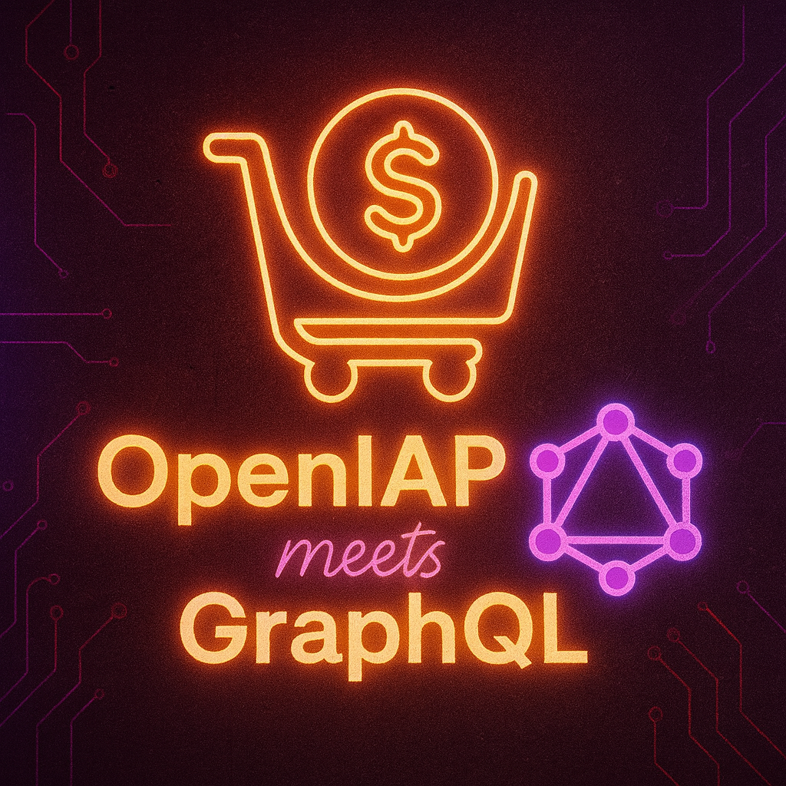

# openiap-gql Code Generation Guide

[](https://github.com/hyodotdev/openiap-gql/actions/workflows/generate-types.yml)

<!-- markdownlint-disable MD033 -->
<p align="center">
  
  <br />
  <strong>OpenIAP meets GraphQL</strong>
</p>
<!-- markdownlint-enable MD033 -->

_Unified schema and multiplatform codegen toolkit for OpenIAP._

This repository is the single source of truth for the OpenIAP GraphQL schema. The SDL
files live in `src/` and are split into common (`type.graphql`, `api.graphql`), error
taxonomy (`error.graphql`), and platform-specific (`*-ios.graphql`, `*-android.graphql`)
definitions.

To keep every consumer in sync, code generation helpers are provided for
TypeScript, Dart, Swift, and Kotlin. Each section below explains the tooling,
commands, and output locations. Update the schema files first, then rerun the
appropriate generator for your target language.

---

## TypeScript

Uses [`@graphql-codegen/cli`](https://www.the-guild.dev/graphql/codegen).

1. Ensure Node 18+ is installed.
2. Install dependencies once: `npm install`
3. Generate types: `npm run generate`
4. Generated output: `src/generated/types.ts`

Configuration lives in `codegen.ts`. The script merges every SDL file and
emits a schema-first type layer that mirrors the documented shapes.

---

## Dart

Uses [`graphql_codegen`](https://pub.dev/packages/graphql_codegen) with
`build_runner`. A ready-to-use package scaffold is located in
`generators/dart/`.

1. Install Dart 3.0+.
2. `cd generators/dart`
3. Fetch dependencies: `dart pub get`
4. Add your `.graphql` operation documents under `lib/` or `graphql/`.
5. Generate code: `dart run build_runner build`
6. Generated output: `generators/dart/lib/generated/`

The `pubspec.yaml` and `build.yaml` already point the generator at the shared
schema files in `../src`. Customize package name, output path, and scalars as
needed for your application.

---

## Swift

Relies on the official [Apollo iOS CLI](https://www.apollographql.com/docs/ios/)
for schema codegen. A helper script is provided in `generators/swift/`.

1. Install the CLI (one time): `brew install apollo-ios-cli`
2. Run the helper: `generators/swift/generate-swift.sh`
3. Generated output: `generators/swift/Generated/`

The script passes every SDL file to the CLI and emits an embedded module named
`OpenIAPGraphQL`. Adjust the script flags to fit your Xcode project (e.g.
`--module-type swiftPackage` or supply operation files via `--operation-paths`).

---

## Kotlin

Recommended tooling is [Apollo Kotlin](https://www.apollographql.com/docs/kotlin).
Use the Gradle plugin inside your Android project to consume the schema. Add a
codegen module (e.g. `:openiap-graphql`) and configure it as follows:

```kotlin
plugins {
  id("com.apollographql.apollo3") version "4.0.0"
}

apollo {
  service("openIap") {
    packageName.set("dev.openiap.graphql")
    schemaFiles.from(
      file("../../src/type.graphql"),
      file("../../src/type-ios.graphql"),
      file("../../src/type-android.graphql"),
      file("../../src/api.graphql"),
      file("../../src/api-ios.graphql"),
      file("../../src/api-android.graphql"),
    )
    // Point to your .graphql operations inside the module
    srcDir("src/main/graphql")
  }
}

dependencies {
  implementation("com.apollographql.apollo3:apollo-runtime:4.0.0")
}
```

Then run `./gradlew :openiap-graphql:generateApolloSources` to regenerate the
models. Keep your query/mutation documents under `src/main/graphql` inside that
module.

If you prefer to consume the pre-generated `src/generated/Types.kt` models from
this repo (via `npm run generate:kotlin`), add the JSON serialization runtime to
your Gradle module:

```kotlin
dependencies {
  implementation("org.jetbrains.kotlinx:kotlinx-serialization-json:1.7.3")
}
```

---

## Workflow Tips

- Treat the SDL files in `src/` as the canonical schema. Commit schema updates
  before shipping generated code.
- Regenerate types whenever you change schema shape or add operations in your
  client projects.
- If you introduce custom scalars, make sure to extend the respective generator
  config (TypeScript `codegen.ts`, Dart `build.yaml`, Kotlin Gradle config,
  Swift `generate-swift.sh`) so they map to the desired native types.
- Use version control to keep generated artifacts out of long-lived diffs unless
  they are part of the published SDKs.
